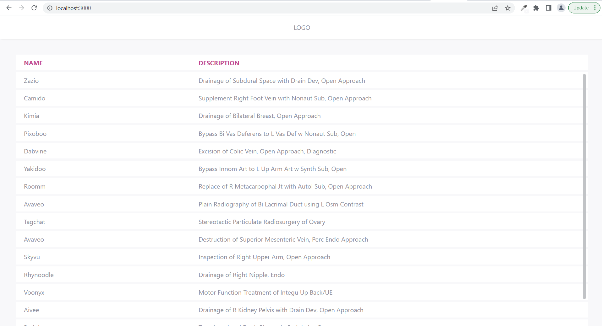
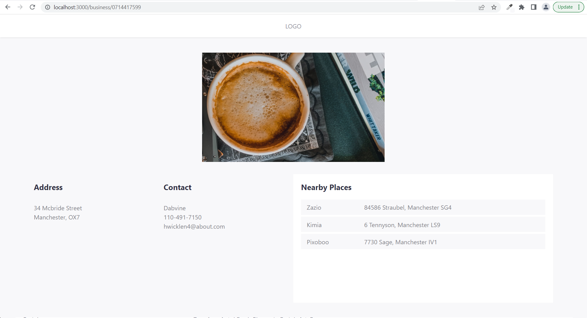

# Business Directory

## Summary 

The goal of this project is to create a very basic business directory.
This project was bootstrapped with [Create React App](https://github.com/facebook/create-react-app), using the [Redux](https://redux.js.org/) and [Redux Toolkit](https://redux-toolkit.js.org/) TS template.

### Main screen - Businesses List View

### Details screen - Selected Business Details View

### API Endpoints

http://localhost:3000 – Businesses List View.

http://localhost:3000/:id – Business Details View.

## Available Scripts

In the project directory, you can run:

### `npm start`

Runs the app in the development mode.\
Open [http://localhost:3000](http://localhost:3000) to view it in the browser.

The page will reload if you make edits.\
You will also see any lint errors in the console.

### `npm test`

Launches the test runner in the interactive watch mode.

### `npm run build`

Builds the app for production to the `build` folder.